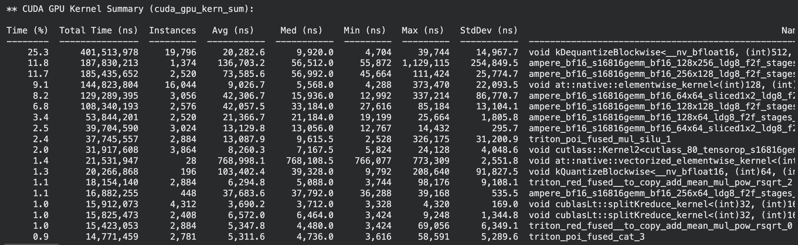

# RAG Project

This is a Retrieval Augmented Generation Project for learning purposes. The main goal wasn't to get the best possible results but to optimize the pipeline by identifying bottlenecks and make it run fast.

### System Design

This project had a standard system design for a RAG workflow.

### Optimization

| Phase       | Share of total time | 
|:------------|:--------------------| 
| **Embed**   | 0.4%                | 
| **Search**  | 0.1%                |
| **Prefill** | 0.7%                | 
| **Decode**  | 99.1%               |

It is clear that the decode phase is where we can optimize. The first optimization I did was to use vLLM to do the model serving

| Model                     | Tokens/s | 
|:--------------------------|:---------| 
| **Standard HF Model**     | 34.9     | 
| **Model served via vLLM** | 195.4    |

Since decode is memory bound, I quantized the weights to fp8 (so that the transfer from HBM is faster). This gave me additional speedup in decode.

| Model                                           | Tokens/s | 
|:------------------------------------------------|:---------| 
| **Standard HF Model**                           | 34.9     | 
| **Model served via vLLM**                       | 195.4    |
| **Model served via vLLM with fp8 quantization** | 231.4    |

I tried using the `bitsandbytes` quantization parameter (INT4) to see if I could get an additional speedup. But to my surprise I got the same speedup as the standard fp16 model with vLLM.
I used `nsys` to investigate this and saw that the de-quantization kernel took the most amount of time. I suspect the kernels used for fp16 had the de-quantisation part and the `matmul` parts fused, where in the `bitsandbytes` they were two separate, hence we couldn't get the desired speedup as the values had to travel back and forth from HBM.

I stuck to fp8 quantization, but I still need to show that the there was no degradation in quality of the model. For this, I used another more powerful (Claude) as a judge (LLM as a judge paradigm), to determine the quality of the fp8 model.
On a set of 15 questions, I asked Claude which of the two answers (from fp16 and fp8) were correct considering factual correctness considering context.

| No of questions | Winner | 
|:----------------|:-------| 
| **5**           | fp16   | 
| **4**           | fp8    |
| **6**           | tie    |

These are a bit noisy results and may require manual check, but LLM as a Judge can be used as a general strategy for comparing two RAG models.